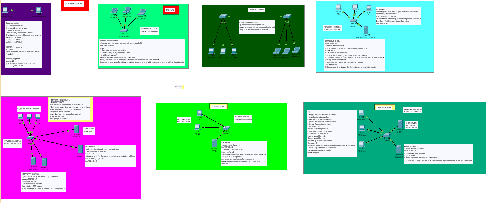
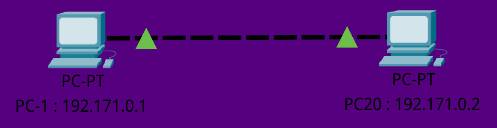
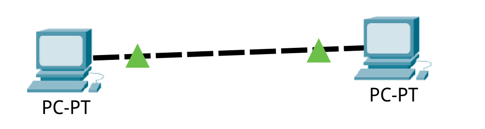
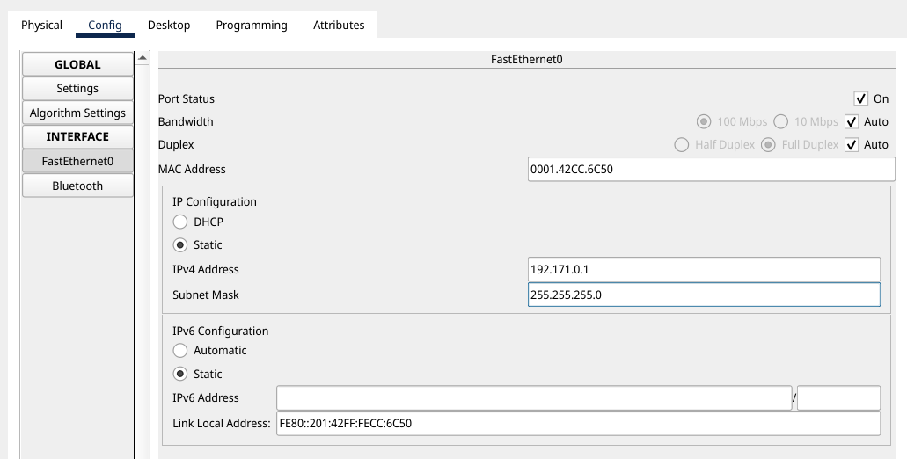
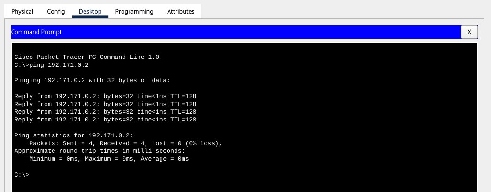
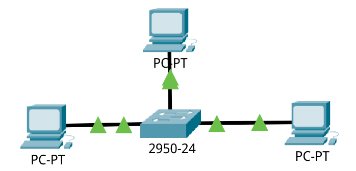

# BASICS , LANS & SERVERS

**full overview**

## BASICS

#### Connecting 2 computers

Before you connect any computers you need an network address to use
aka an [ip address](https://en.wikipedia.org/wiki/IP_address) \
Here for pc-1 the ip address is : 192.171.0.1 \
where **192.171.0** is the network and **.1** is the host \
hence our 2 computers on network **192.171.0.0** are

> **pc-1 : 192.171.0.1** \
> **pc-2 : 192.171.0.2**

after getting your network you will need to set up the hosts( computers ) \
then connect them with a cable \

| DEVICES           | CABLE                                   |
| ----------------- | --------------------------------------- |
| SAME DEVICES      | Copper cross-over throught copper cable |
| DIFFERENT DEVICES | Copper straight through cable           |

Since our pcs are the same we will use Copper cross-over \

If they are conncted you should see this \

Give it an ip ( give both computers an ip ) \

Testing if the ip works \

if you received back **pings** it worked

## LANS

connecting 2 computers is cool but what about 3 \
when you have 2 or more computers you have a local network, aka lan(local area network) \
for this you need a switch to help you connect 3 or more computers \
and for DIFFERENT devices you use a copper straight through cable \

